#FLARE On 2015

This set provides solutions to the 2015 FireEye Labs Advanced Reverse Engineering (FLARE) Challenge.  The challenge spanned from 28 Jul 2015 to 08 Sep 2015.

<Enter statistics here>

This directory contains some of the solutions that we came up with for each of the challenges.  We encourage you to try the challenges out and find solutions of your own.

##Challenge 1
#####Binary: i_am_happy_you_are_to_playing_the_flareon_challenge
#####Type: PE Executable
#####Arch: x86

###Josh's Solution
The challenge starts off with level 1 which is fairly trivial. You are given an executable which prompts you for the correct password.
<br>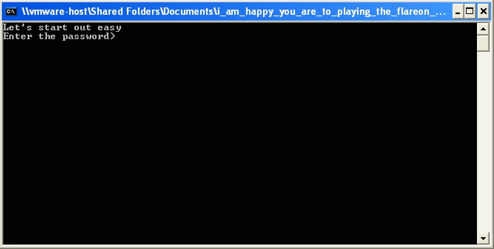<br>
Looking at the disassembly, I found the program XOR's each character in the user input with 0x7D and compares the result to the elements in an array at address `0x402140`. If the result of XOR-ing each char in the user input matches all chars in the array, "You are success" is printed. 

<br>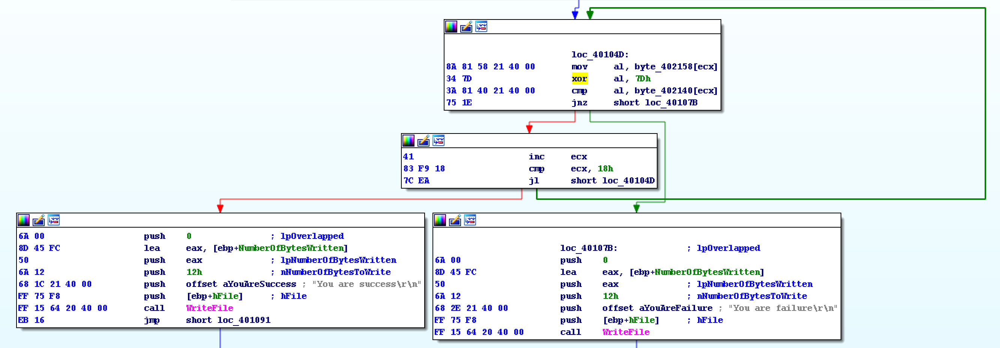<br>
<br>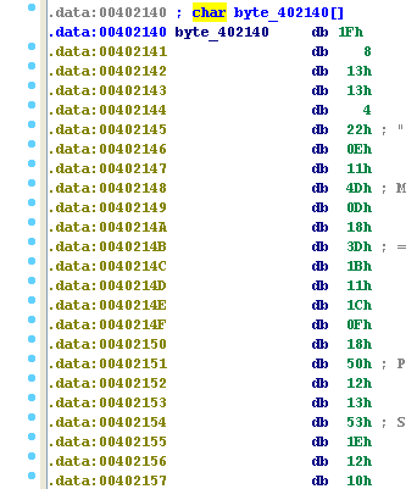<br>

To solve this challenge, just XOR every character in the array with 0x7D. This can be done very quickly in Python.

```bash
rh0gue@deception:~/spartansecurity/Writeups/flareon15$ python
Python 2.7.8 (default, Nov  7 2014, 23:35:36) 
[GCC 4.2.1 Compatible Apple LLVM 6.0 (clang-600.0.54)] on darwin
Type "help", "copyright", "credits" or "license" for more information.
>>> x = [0x1f,0x08,0x13,0x13,0x4,0x22,0xe,0x11,0x4d,0xd,0x18,0x3d,0x1b,0x11,0x1c,0xf,0x18,0x50,0x12,0x13,0x53,0x1e,0x12,0x10]
>>> for y in x:
...     print chr(y^0x7d)
... 
b
u
n
n
y
_
s
l
0
p
e
@
f
l
a
r
e
-
o
n
.
c
o
m
``` 

##Challenge 3
#####Binary: elfie
#####Type: PE Executable
#####Arch: x86

###Armen's Solution
This program displays a window with a graphic in a text box.
<br></br>

Typing into it and pressing "enter" seems to do nothing.  We guess that a certain input is required to obtain the next email.

Searching through the strings reveals text that indicates use of the Python runtime.  Taking a guess that the managed code will copy the key string (with the text "@flare-on.com") somewhere in memory where the user has no control, we assume that taking a memory dump and searching through its strings will reveal the email to the next challenge.

Doing this after opening the program does nothing.  However, after entering some text and trying again, the email is easily found in the next process dump.  Apparently some string-reversal was used for obfuscation, but when the string was reconstructed for verification with the user's input, the plaintext email was left in memory as an artifact.
<br>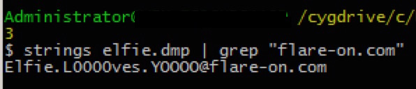</br>

Why look at the code when you can have the email for free? :)

##Josh's Solution
^I should've done it that way. I can't believe a wrote a shitty script for this.
```python
#!/usr/bin/python
import subprocess
import os
import base64

target=['OOO0OOOOOOOO0000O000O00O0OOOO00O',
        'O0O00OO0OO00OO00OO00O000OOO0O000',
        'O00OO0000OO0OO0OOO00O00000OO0OO0',
        'O00OO00000O0OOO0OO0O0O0OO0OOO0O0',
        'O0O00OO0O0O0O00OOO0OOOOOO00OO0O0',
        'O0OO00O0000OOOO00OOO0OO0000O0OO0',
        'O0O0OO000OOO00000OO0OOOO0OO00000',
        'OO0OOO0O00000O00OOOOO0OO0OO00OOO',
        'O000000000OOO00OO00000OOOO00OOOO',
        'OOO0OOO00O0OO0O0OOOO00OO00OO0O00',
        'O0OO0OOO00O0OOO0O00OOO0O0OOOO00O',
        'OOOO000O0OOOOO0O0O0000O0O0OO00O0',
        'O00O0O00OO0O0OO00O0OO0O00O0O00OO',
        'OOOOOOO0O0O00OOO0OO00O0O00OOOOO0',
        'O00O000O0O00000O00OO0OO0OOO000O0',
        'O0O000O0O0O0OO0000O0O0OOO0OOOOO0',
        'O000000OOO0O00OO00OO00OO0OO00O0O',
        'OOOOOO000OOO0O000O0O00OO0OOOO0O0',
        'O00OOOO0OO0O000OO0OOOOO0OOOO0000',
        'O0OO00000OOOOO0OOO000O00000OOO00',
        'OOO00O0OOOOO00OO0OOOOO0O0O00O0O0',
        'OOO000O0OOO0OOO0OOOO0OOOOO0O0O00',
        'OO0OOOO0O00OOOO0OOOO0O0OOO0OO0O0',
        'O0OO0OO00000OOOO0OOOOO0O00O0O0O0',
        'OO00OOO00OO0OOO000O000000O0O0000',
        'OO0O0000OO0000OO000OO0O0OO0O00OO',
        'OO00000O0OO000O0O000OOOOOOO0O0OO',
        'O0O00O000OOOO000O0OOOOO0O000000O',
        'O000OOOOOOOOOO0O0OO0OO000OO000O0',
        'O0OO00OOO0O0OOOO0O0O0000000O0OOO',
        'O0000O0OOOO00OO0OOO00OO000O0000O',
        'OOOOO0OO0O00OOOOOO00O00000O0OO0O',
        'OO0O0OOOO0O000OOOO00O0O00O0O0O0O',
        'O0OOO00OOOO0OO0OO0O000O0OO0OO000',
        'O0OOOO0O00OOOOO0OOO000O00O00OO00',
        'OO0OO00000O00O0000000O00O0OO0O00',
        'OOO0000OO00000OO00O0OO0000OOOO00',
        'O00O000O00O0O00OO0OO0O000000OOOO',
        'O000O00O000O00O000O0OO00O0000O0O',
        'O0O0OO0OO0O0OOO0O0OOO00O0OOOOO00',
        'O0OOO0OO00OO0OOO00OO0O0O0O0O00OO',
        'OO0OOO00000OO000O0OOOO00O0O0O00O',
        'O00OO00OOO0OOOO0OOOO0OO00000OOO0',
        'OOOOOO0OO0O0OO0O0000OOO0O00O0O0O',
        'O0O0O00O0000O00OOOO000O00OO00O00',
        'OOOOO0000OO000O0O0000OOOOO0000OO',
        'OO00OOO0O00OO0OO0OOOO000OO0000OO',
        'O00000O0OO00O0OO00000O000OOO00O0',
        'O0OOO00O0O0O0OO00000OO0OO00O00OO',
        'O0000OO00000000OO000O0OOO000OO00',
        'OO0OO0O00000O0O000OOO0O0O0O000O0',
        'OOOOO0O00OOOOO0O0OOOOOOO0OO0OO00',
        'OOOOO00O0O0O0O0O0OO00O0OOOO00O0O',
        'O0OOOO0OO000OOOOOO0O0OO0OOO0O000',
        'OOOO000OOOOO00000O000OO0O00O0O0O',
        'O00OOO000O0O0OOOO00O0O00O0OO00OO',
        'OO0O00OO0OO00O0O000O0000O0OOOOO0',
        'OO0O0O00OO00OOOOOO0O0O0OOO0OOO0O',
        'OO0OOO00OOO00OOOOOOOOOOOO00OO00O',
        'OOO0000O0OO0OOOOO000O00O0OO0O00O',
        'OOO0O00O00OOOOOOO00OOOO0000O0O00',
        'O0O00OO00O0O00O0O00O0OOO00O0O0OO',
        'O00OOOOO000O00O0O00000OOO0000OOO',
        'O0O0OOO000O000OO0O0O0OOOOO0OO000']

def getchunk(chunk):
  decodeme=""
  p = subprocess.Popen('cat elfie | grep '+chunk, stdout=subprocess.PIPE,shell=True)
  out = p.communicate()
  for i in out[0].split(os.linesep):
    try:
      decodeme+=i.split("'")[1]
    except:
      return decodeme

def pad(chunk):
  missingpadding= 4 - len(chunk) % 4
  print missingpadding
  chunk+=b'='*missingpadding
  return chunk

chunk = ""
for i in target:
  chunk += getchunk(i)
print pad(chunk).decode('base64')
```

```bash
jwang@avantgarde:~/Documents/flareon15/elfie$ python elfie.py | grep @
        if (O0O0O0000OOO000O00000OOO000OO000 == ''.join((OO00O00OOOO00OO000O00OO0OOOO0000 for OO00O00OOOO00OO000O00OO0OOOO0000 in reversed('moc.no-eralf@OOOOY.sev0000L.eiflE')))):
```
##Challenge 4
#####Binary: youPecks
#####Type: PE Executable
#####Arch: x86

###Armen's Solution
The first thing we see when throwing this binary into PEiD is that it is packed, apparently with UPX (although it is reportedly packed with Crypto-Lock v2.02, according to the pedump utility.)
<br>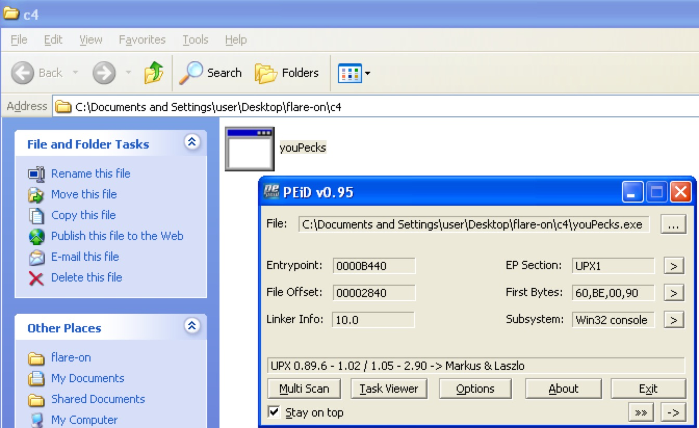</br>

Initially running the program yields the following output:
`2 + 2 = 4`

We unpack the program with the UPX utility using the following command:
`upx -d youPecks`

The program now reads nicely in a disassembler.  However, running the unpacked version yields new output.  The screenshot below shows each of the above steps:
<br>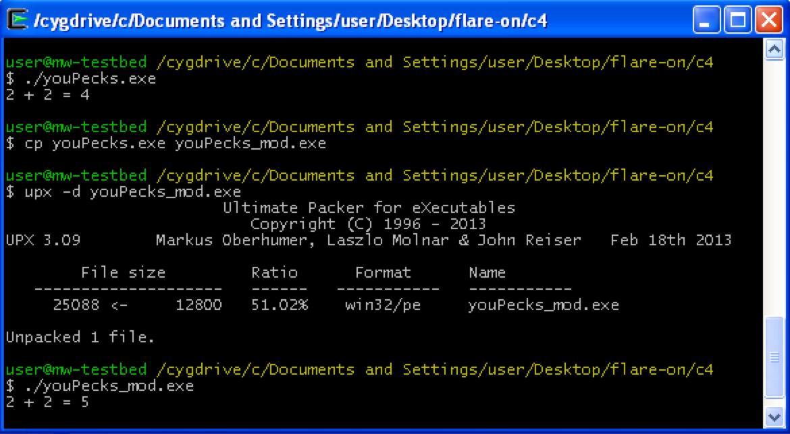</br>

Clearly, unpacking the program using the UPX utility has changed the binary.

Continuing through to the disassembly of the unpacked version (for readability, but keeping in mind that the program has been transformed), we can see the point where `2 + 2 = 5` is printed.  Clearly this condition can never be satisfied.
<br>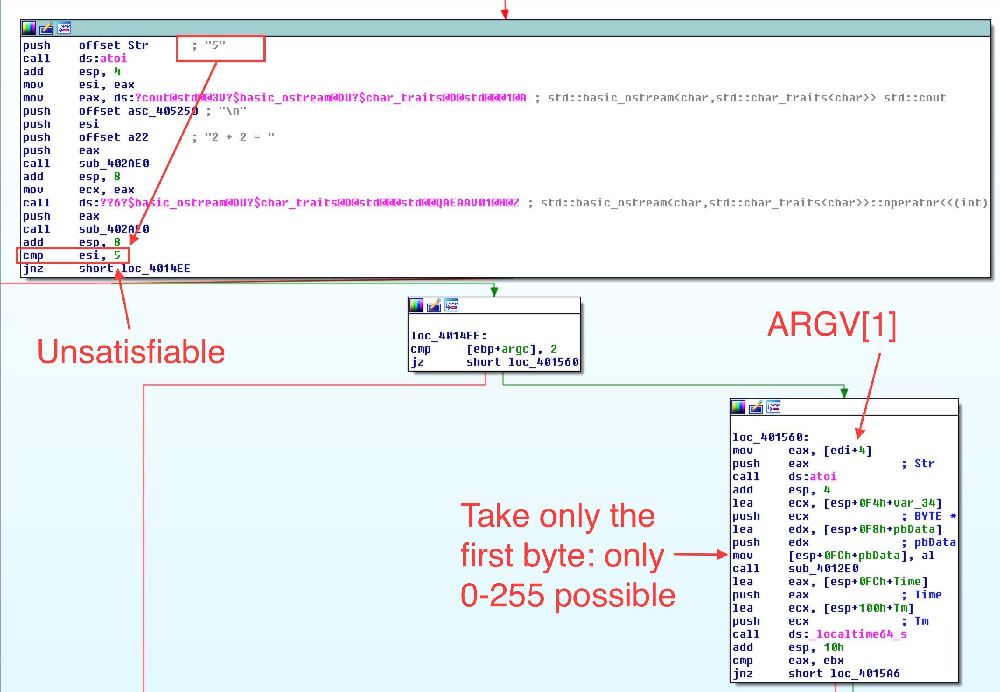</br>

What's supposed to happen afterward is that the user input is converted into an integer.  Notice that only the first byte is used (meaning that there are really only 256 possible inputs).  Then the MD5 of the byte is taken.
<br>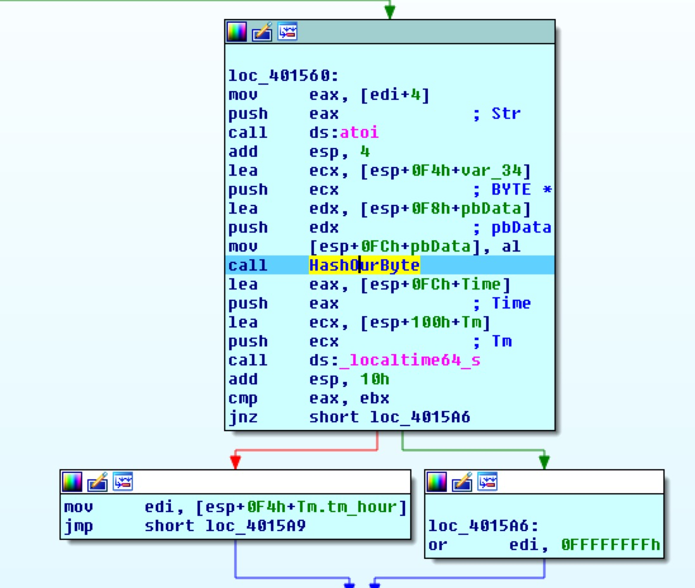</br>

A series of checks using the current time occurs, each using some Base64-encoded text.  At the end of these checks, we see the hour being used again.  It indexes into an array which holds the Base64 decodes of the encoded strings in the above checks.  The 32-bits of binary are compared with the MD5 produced by our user input.  The user input must match one of the Base64 decodes, and that will be dependent on the hour.
<br>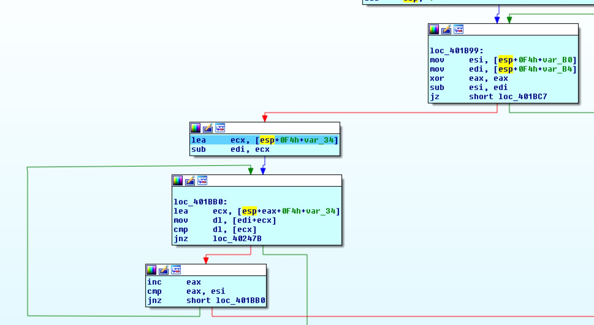</br>

Next is another series of checks with Base64-encoded text.  These are used at the end to decrypt the email to the next challenge.

Now that we have an idea of how the program works, we can start working on the packed binary, since the unpacked binary will never produce working results.  With the knowledge that only 256 different inputs are possible, a simple bash script such as the following can be used to brute force the program:
```bash
i=0
while [ $i -lt 256 ]; do
  ./youPecks.exe $i
  i=$((i+1))
done
```

The number of iterations required to reach a solution varies depending on the hour.

<br>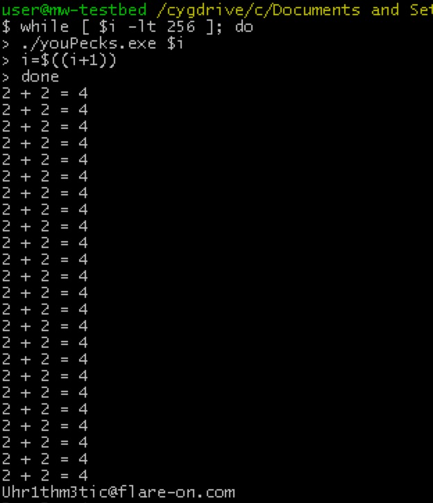</br>

##Challenge 5                              
#####Binary: challenge, sender
#####Type: PCAP, PE Executable
#####Arch: x86

###Josh's Solution

The challenge contains both a challenge.pcap file and a sender.exe file.

Upon examining the pcap file, I noticed multiple HTTP POST packets being sent, each containing 4 bytes of ASCII characters in the body:


Putting all the 4 bytes together produces what appears to be the base-64 encoded string, `UDYs1D7bNmdE1o3g5ms1V6RrYCVvODJF1DpxKTxAJ9xuZW==`

I tried base-64 decoding the string, but it simply produced gibberish.

Looking at the sender.exe file, I noticed the program takes user provided input and adds each character of the user input string to each corresponding character in the string "flarebearstare" and replaces the original character with the result. If the length of the user input string is greater than the length of "flarebearstare", after adding the last "e" in "flarebearstare" to the corresponding character in the user input string,"flarebearstare" is iterated through again from the beginning, and the next character in the user input string is added to "f", the following character after that is added to "l", and so on and so forth.


```C
void __fastcall mutate_input(int input, unsigned int a2)
{
  unsigned int iterator; // esi@1

  iterator = 0;
  if ( a2 )
  {
    do
    {
      *(_BYTE *)(iterator + input) += flarebearstare[iterator % 0xE];
      ++iterator;
    }
    while ( iterator < a2 );
  }
}
```

The resulting mutated string then appears to be base-64 encoded and the result is sent as a series of HTTP POST requests. However, I noticed that the base-64 encoding scheme appeared to be slightly different than normal. Sender.exe uses an alphabet structure that switches the order of lower-case letters and upper-case characters. 


So, the program base-64 encodes the mutated user input, but switches the case of each letter. So, the actual base-64 encoded string that needs to be reversed is `udyS1d7BnMDe1O3G5MS1v6rRycvVodjf1dPXktXaj9XUzw==` rather than `UDYs1D7bNmdE1o3g5ms1V6RrYCVvODJF1DpxKTxAJ9xuZW==`. 

From there, I simply decoded the proper base-64 string and subtracted from each character in the decoded string its corresponding character in the "flarebearstare" string to get the flag.

```python
#!/usr/bin/python

x = [0xb9,0xdc,0x92,0xd5,0xde,0xc1,0x9c,0xc0,0xde,0xd4,
     0xed,0xc6,0xe4,0xc4,0xb5,0xbf,0xaa,0xd1,0xc9,0xcb,
     0xd5,0xa1,0xd8,0xdf,0xd5,0xd3,0xd7,0x92,0xd5,0xda,
     0x8f,0xd5,0xd4,0xcf]
y = "flarebearstare"*5

solution=[]

for i in range(0,34):
    solution.append(chr(x[i]-ord(y[i])))

print ''.join(solution)
```

```shell
jwang@avantgarde:~/Documents/flareon15$ python l5.py 
Sp1cy_7_layer_OSI_dip@flare-on.com
```

##Challenge 6                              
#####Binary: libvalidate.so, android.apk
#####Type: Native Android Library, Android Application Package (APK)
#####Arch: ARM

###Josh's Solution

For this challenge, you are given an `android.apk` file. So first thing's first, I extracted and decompiled the source. I also installed the `android.apk` on an android emulator I setup:

<br><br>

Basically, for this challenge you have to figure out what the correct text is, which is also the email address for level 7.

Inside the decompiled source, I found `MainActivity.class` validated the user input using an imported library called `validate`.

```Java
package com.flareon.flare;

import android.content.Intent;
import android.os.Bundle;
import android.support.v7.app.ActionBarActivity;
import android.widget.TextView;
import java.nio.charset.Charset;
import java.nio.charset.CharsetEncoder;

public class ValidateActivity
  extends ActionBarActivity
{
  static
  {
    System.loadLibrary("validate");
  }
  
  protected void onCreate(Bundle paramBundle)
  {
    super.onCreate(paramBundle);
    paramBundle = new TextView(this);
    paramBundle.setTextSize(40.0F);
    paramBundle.setGravity(17);
    String str = getIntent().getStringExtra("com.flare_on.flare.MESSAGE");
    if (Charset.forName("US-ASCII").newEncoder().canEncode(str)) {
      paramBundle.setText(validate(str));
    }
    for (;;)
    {
      setContentView(paramBundle);
      return;
      paramBundle.setText("No");
    }
  }
  
  public native String validate(String paramString);
}
```

This library can be found under the directory, `/lib/armeabi` as `libvalidate.so`.


After getting [remote debugging setup](https://www.trustwave.com/Resources/SpiderLabs-Blog/Debugging-Android-Libraries-using-IDA/), 

[to be finished]

<br>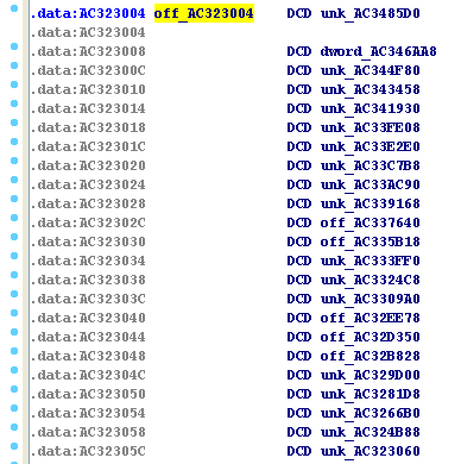</br>
<br>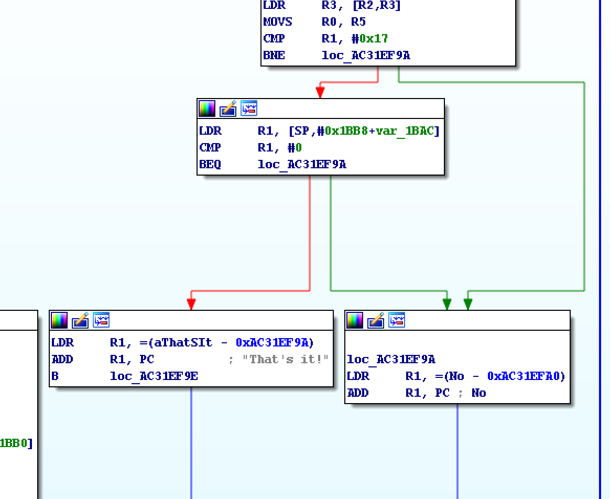</br>

```Python
#!/usr/bin/python

import math

bases = [0xac3485d0,0xac346aa8,0xac344f80,0xac343458,0xac341930,
		 0xac33fe08,0xac33e2e0,0xac33c7b8,0xac33ac90,0xac339168,
		 0xac337640,0xac335b18,0xac333ff0,0xac3324c8,0xac3309a0,
		 0xac32ee78,0xac32d350,0xac32b828,0xac329d00,0xac3281d8,
		 0xac3266b0,0xac324b88,0xac323060]

solution = []
target = []
chars = range(32,127)
for i in chars:
	for j in chars:
		target.append((i<<8)+j)

primes = []
print "[*] building list of primes..."
for num in range(2,30000):
	if all(num%k for k in range(2,num)):
		primes.append(num)

def lpf(i): #get least prime factor
	if i % 2 == 0:
		return 2
	else:
		f=3
		while f <= math.sqrt(i):
			if i%f==0:
				return f
			f = f+2
		return i

def chain(x):
	solution.append(chr(x>>8))
	solution.append(chr(x&0xff))
	
def getchunk(x,a=None,b=None,c=None,d=None,e=None):
	if x and a and b and c and d and e:
		if (x%a==0) and ((x/a)%b==0) and ((x/(a*b))%c==0) and ((x/(a*b*c))%d==0) and ((x/(a*b*c*d))%e==0) and all(x%y for y in primes if (y!=lpf(a) and y!=lpf(b) and y!=lpf(c) and y!=lpf(d) and y!=lpf(e))):
			return x
	if x and a and b and c and d and e==None:
		if (x%a==0) and ((x/a)%b==0) and ((x/(a*b))%c==0) and ((x/(a*b*c))%d==0) and all(x%y for y in primes if (y!=lpf(a) and y!=lpf(b) and y!=lpf(c) and y!=lpf(d))):
			return x
	if x and a and b and c and d==None and e==None:
		if (x%a==0) and ((x/a)%b==0) and ((x/(a*b))%c==0) and all(x%y for y in primes if (y!=lpf(a) and y!=lpf(b) and y!=lpf(c))):
			return x
	if x and a and b and c==None and d==None and e==None:
		if (x%a==0) and ((x/a)%b==0) and all(x%y for y in primes if (y!=lpf(a) and y!=lpf(b))):
			return x
	if x and a and b==None and c==None and d==None and e==None:
		if (x%a==0) and all(x%y for y in primes if (y!=lpf(a))):
			return x
print "[*] pwning..."
#rd 1
for x in target:
	a = 8
	b = primes[((0xac3485dc-bases[0])/2)]
	c = primes[((0xac348618-bases[0])/2)]	
	chunk = getchunk(x,a,b,c)
	if chunk:
		chain(chunk)
#rd 2
for x in target:
	a = primes[((0xac346aaa-bases[1])/2)]
	b = primes[((0xac3473da-bases[1])/2)]
	chunk = getchunk(x,a,b)
	if chunk:
		chain(chunk)
#rd3
for x in target:
	a = 4
	b = primes[((0xac344f86-bases[2])/2)]
	c = primes[((0xac3450cc-bases[2])/2)]
	chunk = getchunk(x,a,b,c)
	if chunk:
		chain(chunk)
#rd4		
for x in target:
	a = 8
	b = primes[((0xac343472-bases[3])/2)]
	c = primes[((0xac34347e-bases[3])/2)]
	chunk = getchunk(x,a,b,c)	
	if chunk:
		chain(chunk)
#rd5
for x in target:
	a = 2
	b = pow(primes[((0xac341934-bases[4])/2)],2)
	c = primes[((0xac3419ec-bases[4])/2)]
	chunk = getchunk(x,a,b,c)	
	if chunk:
		chain(chunk)
#rd6
chunk = primes[((0xac341456-bases[5])/2)]
chain(chunk)
#rd7
for x in target:
	a = 16
	b = primes[((0xac33e2ea-bases[6])/2)]
	c = primes[((0xac33e31c-bases[6])/2)]	
	chunk = getchunk(x,a,b,c)	
	if chunk:
		chain(chunk)
#rd8
for x in target:
	a = primes[((0xac33c7d8-bases[7])/2)]
	b = primes[((0xac33c86e-bases[7])/2)]
	chunk = getchunk(x,a,b)
	if chunk:
		chain(chunk)
#rd9
for x in target:
	a = 4
	b = primes[((0xac33aca8-bases[8])/2)]
	c = primes[((0xac33acd4-bases[8])/2)]
	chunk = getchunk(x,a,b,c)
	if chunk:
		chain(chunk)
#rd10
for x in target:
	a = primes[((0xac33916e-bases[9])/2)]
	b = primes[((0xac3395c8-bases[9])/2)]
	chunk = getchunk(x,a,b)
	if chunk:
		chain(chunk)
#rd11
for x in target:
	a = primes[((0xac337642-bases[10])/2)]
	b = primes[((0xac337fd0-bases[10])/2)]
	chunk = getchunk(x,a,b)
	if chunk:	
		chain(chunk)
#rd12
for x in target:
	a = 8
	b = primes[((0xac335b1a-bases[11])/2)]
	c = primes[((0xac335caa-bases[11])/2)]
	chunk = getchunk(x,a,b,c)
	if chunk:
		chain(chunk)		
#rd13
for x in target:
	a = pow(primes[((0xac333ff4-bases[12])/2)],2)
	b = primes[((0xac333ffa-bases[12])/2)]
	c = primes[((0xac33401c-bases[12])/2)]
	chunk = getchunk(x,a,b,c)
	if chunk:
		chain(chunk)
#rd14
for x in target:
	a = 4
	b = primes[((0xac332778-bases[13])/2)]
	chunk = getchunk(x,a,b)
	if chunk:
		chain(chunk)
#rd15
for x in target:
	a = pow(2,2)
	b = pow(primes[((0xac3309a2-bases[14])/2)],4)
	c = primes[((0xac3309a6-bases[14])/2)]
	d = primes[((0xac3309a8-bases[14])/2)]
	chunk = getchunk(x,a,b,c,d)
	if chunk:
		chain(chunk)
#rd16
for x in target:
	a = pow(primes[((0xac32ee7a-bases[15])/2)],2)
	b = primes[((0xac32f1d2-bases[15])/2)]
	chunk = getchunk(x,a,b)
	if chunk:
		chain(chunk)
#rd17
for x in target:
	a = 64
	b = pow(primes[((0xac32d352-bases[16])/2)],2)
	c = pow(primes[((0xac32d356-bases[16])/2)],2)
	chunk = getchunk(x,a,b,c)
	if chunk:
		chain(chunk)
#rd18
for x in target:
	a = 4
	b = primes[((0xac32b82a-bases[17])/2)]
	c = primes[((0xac32b82c-bases[17])/2)]	
	d = primes[((0xac32b836-bases[17])/2)]	
	e = primes[((0xac32b838-bases[17])/2)]
	chunk = getchunk(x,a,b,c,d,e)
	if chunk:
		chain(chunk)
#rd19
for x in target:
	a = 2
	b = primes[((0xac32a89e-bases[18])/2)]
	chunk = getchunk(x,a,b)
	if chunk:
		chain(chunk)
#rd20
for x in target:
	a = primes[((0xac3281f8-bases[19])/2)]
	b = primes[((0xac328280-bases[19])/2)]
	chunk = getchunk(x,a,b)
	if chunk:
		chain(chunk)
#rd21..almostdone
for x in target:
	a = 2
	b = primes[((0xac3266bc-bases[20])/2)]
	c = primes[((0xac3267d2-bases[20])/2)]
	chunk = getchunk(x,a,b,c)
	if chunk:
		chain(chunk)
#rd22...one more
for x in target:
	a = pow(primes[((0xac324b8c-bases[21])/2)],4)
	b = primes[((0xac324b96-bases[21])/2)] 
	chunk = getchunk(x,a,b)
	if chunk:
		chain(chunk)
#rd23...finally
for x in target:
	a = pow(primes[((0xac323064-bases[22])/2)],2)
	b = primes[((0xac323066-bases[22])/2)]
	c = primes[((0xac3230aa-bases[22])/2)]
	chunk = getchunk(x,a,b,c)
	if chunk:
		chain(chunk)

print ''.join(solution)
```

```Bash
rh0gue@deception:~/Documents/flareon15/chal6$ python chal6.py 
[*] building list of primes...
[*] pwning...
Should_have_g0ne_to_tashi_$tation@flare-on.com
```

##Challenge 7
#####Binary: YUSoMeta
#####Type: PE Executable (.NET)
#####Arch: x86

###Armen's Solution
Using PEiD reveals that the binary is .NET.  Using ILSpy to decompile it shows us obfuscated code.  Some symbols are not even printable ASCII characters.
<br>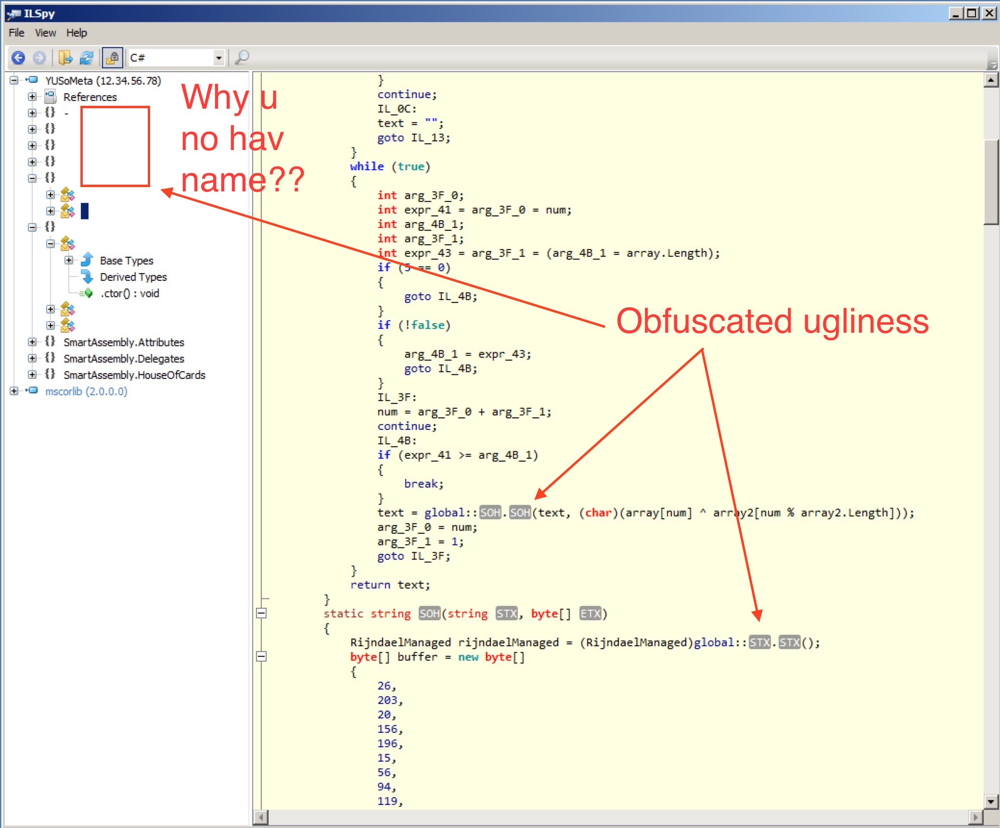</br>

The program de4dot can be used to unobfuscate it.  Looking through the Main() function of the unobfuscated code, we see that our input is compared with a string produced by Class3.smethod_0() concatenated with '_' and a string produced by Class3.smethod_3().  Following these static methods shows that bytes of code in the binary are used to produce these strings.  This means that our unobfuscated binary will change the key needed for the next email to be output.  Otherwise, the Rijndael decrypt will fail.

The Main() function looks very straightforward.  Ultimately, the user input is string-compared against a given value, and if there is a match, then the user value is input, and the email to the next challenge is output.  It would be nice if the variable `b` were passed to Class3.smethod_1 rather than `text`.
<br>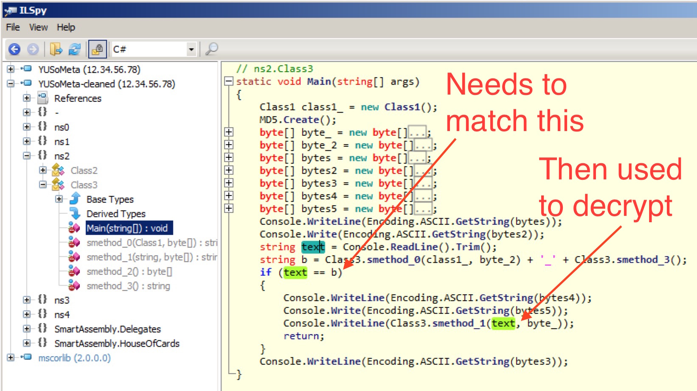</br>

So the plan of action is as follows:
  1. Swap the variable positions for `text` and `b` (so that Console.ReadLine().Trim() is saved to the location of `b`, and Class3.smethod_0() is saved to the location of `text`)
  2. Ignore/nop the *if* conditional
  3. ???
  4. Profit!

To do this, we open the unobfuscated version of the binary in IDA as Microsoft.Net Assembly.  We can see the methods being called and stored into variable locations.
<br>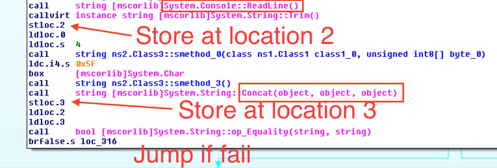</br>

If we look at the branch that is taken if the comparison succeeds, we can see the variable at Location 2 being passed to Class3.smethod_1 to decrypt the next email.  If we switch the locations, then the text that our input is verified against (which we assume is always correct) will be used instead.  However, we must do this in the original binary to ensure that the decryption works properly.
<br>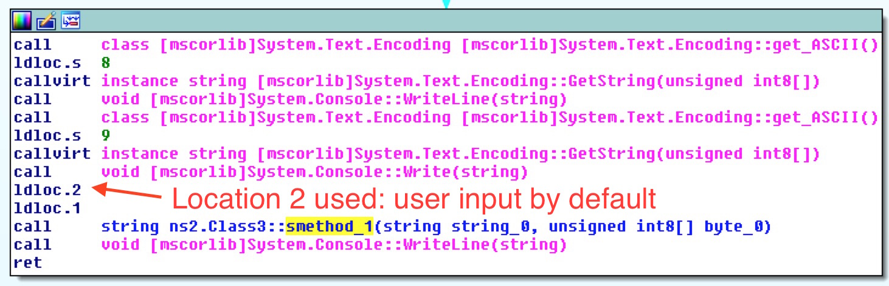</br>

Identifying the location where the input is taken is more difficult because of the obfuscation.  The 0x5F character makes a good anchor point.  We can see the user input being stored with `stloc.2` above, and the output of `Class3.smethod_0 + '_' + Class3.smethod_3()` is stored with the instruction `stloc.3`.  If we highlight the instruction, we see in the hex dump that it is made of the byte 0x0d.  Highlighting the `stloc.2` instruction, we see that it is made of the byte 0x0c.  We patch these bytes in IDA to swap the location where these variables are stored.
<br>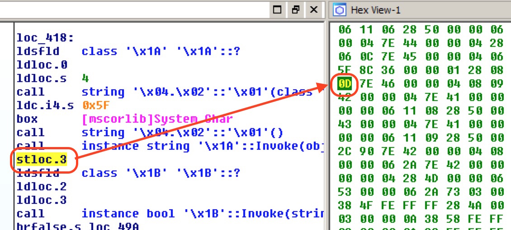</br>

Next, we need to remove the branch.  We want execution to fall through to the location where the user input (now the constant used for verification) is pushed to Class3.smethod_1() and the next email is written to the screen.  We can do this by replacing the string comparison (and its arguments) and the branch with nop instructions.  nop instructions are each one 0x00 byte.  The patched code can be seen in the screenshot below.
<br>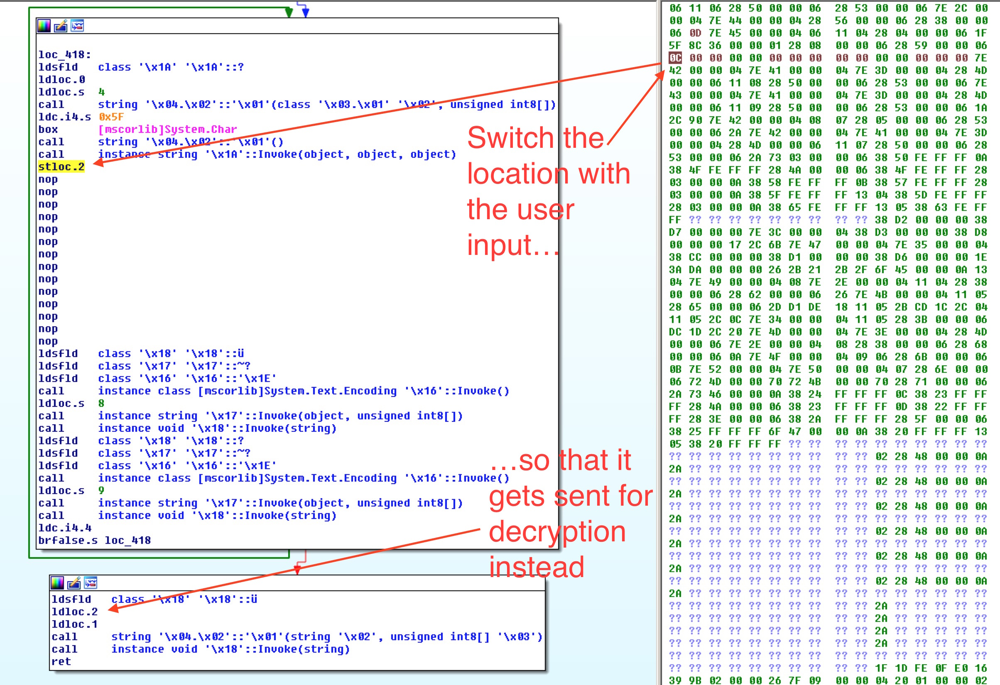</br>

Running the patched program allows us to input anything, and the email to the next challenge will be spit right out.
<br>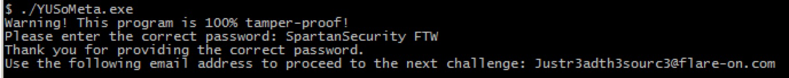</br>

##Challenge 9
#####Binary: you_are_very_good_at_this
#####Type: PE Executable
#####Arch: x86
###Josh's Solution
I noticed there was anti-disassembly being employed so at first I tried manually fixing the bad bytes, turning code to data and vice-versa. However, after a while of doing this, I realized it would be too hard to do this for the whole program manually so I had to try another approach. I then skipped to the last CMP (0x401C27) it makes before branching to either "You are failure" or "You are success". The CMP statement didn't make any sense though because it compared EAX to 0x29, but despite trying different inputs, the value of EAX always remained 0x28d7. After playing around with the binary more and tracing execution, I noticed it referenced FS:[0x30], or the process's PEB. Specifically, it compared the value at offset 0x68 of the PEB to 0x70.
<br>
<br></br>
It was then I realized the program was employing anti-debugging and checking the NTGlobalFlag to determine whether or not the program was being run in a debugger, presumably changing the code somehow if it was. I then used IDAStealth to patch the NTGlobalFlag and then the final CMP made sense. It was checking and comparing to see how many correct characters were used in the right offset of the user input string. Each correct character would increment the value that is eventually stored in register EAX in the final CMP. So, I wrote an IDAPython script to brute force the email address character-by-character, and went to bed. 

```python
from idaapi import *

def testval():
	StartDebugger("","< input.txt","")
	GetDebuggerEvent(WFNE_SUSP, -1)
	eax = GetRegValue("EAX")
	GetDebuggerEvent(WFNE_SUSP, -1)
	StopDebugger()
	GetDebuggerEvent(WFNE_SUSP, -1)
	return eax

AddBpt(0x00401C27)
GetDebuggerEvent(WFNE_SUSP, -1)

for i in range(1,41):
	for j in range(33,126):
		f = open('input.txt', 'r+')
		s = open('solution.txt','r')
		line = s.readline()
		f.write(line+chr(j))
		f.close()
		s.close()
		a = testval()
		if (a==i):
			s = open('solution.txt','a+')
			s.write(chr(j))
			s.close()
			break
```

The next morning, I had the e-mail solved.

##Challenge 10
#####Binary: loader
#####Type: PE Executable
#####Arch: x86

###Josh's Solution
When I first executed the program, nothing appeared to happen. Upon closer inspection in Anubis, however, I discovered it created 2 files: `c:/windows/system32/ioctl.exe` and a kernel driver `c:/windows/system32/challenge.sys`
<br>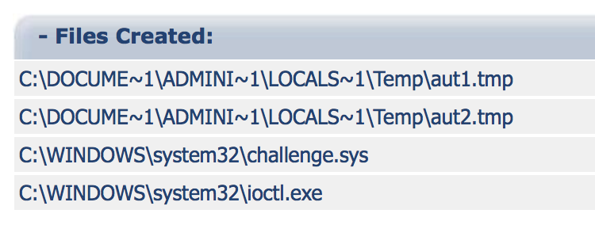<br>
It also created and ran a service to load the device driver, `challenge.sys`, into the kernel.
The `ioctl.exe` is, presumably, responsible for sending driver IOCTLs to the driver's IOCTL handler in `challenge.sys`. At first glance, the `challenge.sys` device driver contains some pretty gnarly functions:
<br>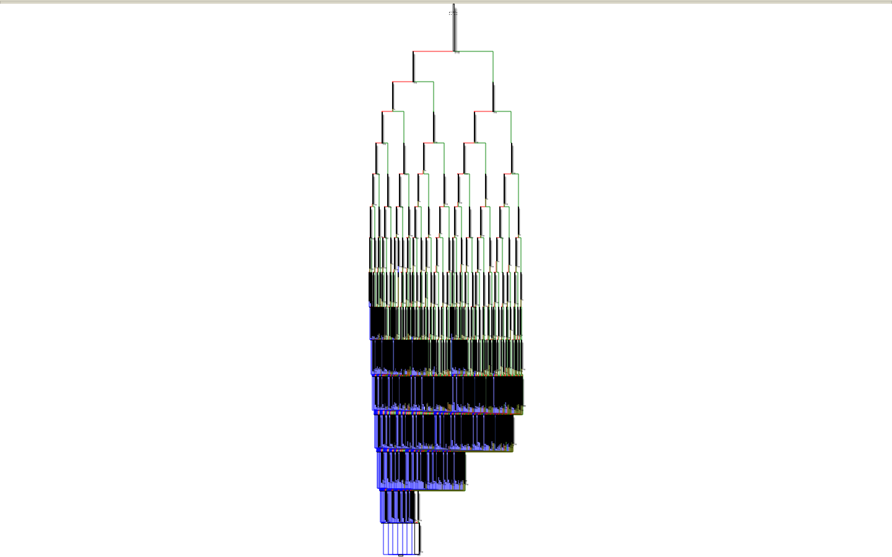<br>
<br>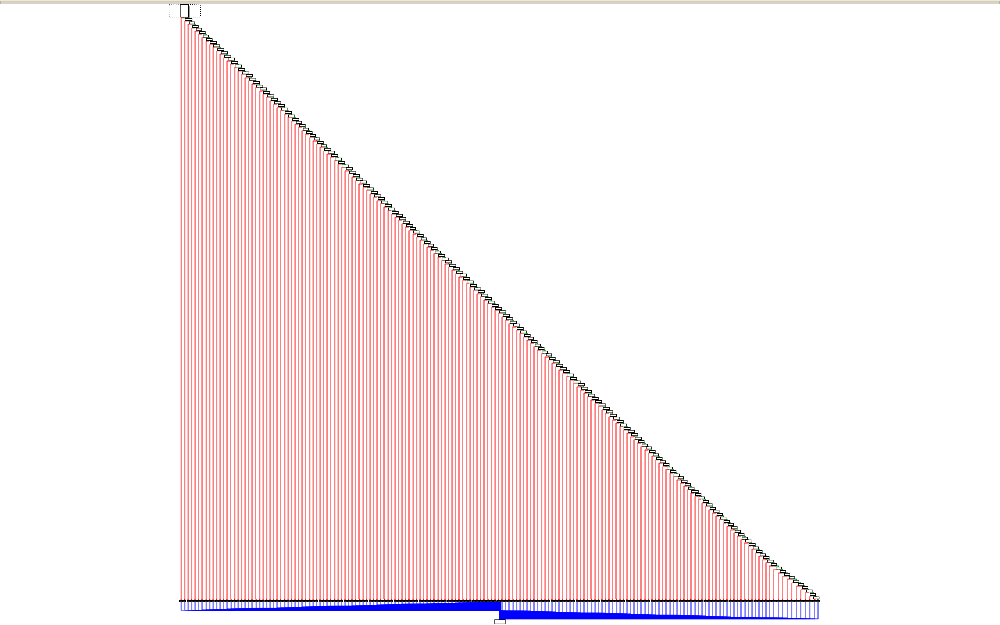<br>
Looking through the program `loader.exe` in IDA Pro I noticed it was or contained an autoit script. I then decompiled this script by opening `loader.exe` in exe2aut. In the decompiled code, I noticed a couple calls to the function `dothis()`. 

```
FileInstall("ioctl.exe", @SystemDir & "\ioctl.exe")
$nret = dothis("0x96c581bc009905e76931875a583f97a738b764eb67f35c802194bf86123b943d1907619488a31a26cf29ba5f5e57ed5c5a37cb5d67dc2020a7e6d55cadefba32aba3ed77f0e18e41a571e74a8a7614a895d7c8827c46028761994543bf449138c65a6e7b5039792c85be5b4998c9950d2497f73cd88d186a6bffe3634bd250ec59e2", "flarebearstare")
If $nret Then
	If dothis("0x96d587b8139933d17e3598505e729da736bb66aa6cfa5180289fb6845530", "flarebearstare") Then
		dothis("0x9aee96b50da818d16f368556131aecfc69ef21a440f24fcc6bd1f3bd1e76db69574a6c8d81ed53688a7eaa364e53fd0700", "flarebearstare")
	EndIf
EndIf

Func decrypt($data, $key)
	Local $opcode = "0xC81001006A006A005356578B551031C989C84989D7F2AE484829C88945F085C00F84DC000000B90001000088C82C0188840DEFFEFFFFE2F38365F4008365FC00817DFC000100007D478B45FC31D2F775F0920345100FB6008B4DFC0FB68C0DF0FEFFFF01C80345F425FF0000008945F48B75FC8A8435F0FEFFFF8B7DF486843DF0FEFFFF888435F0FEFFFFFF45FCEBB08D9DF0FEFFFF31FF89FA39550C76638B85ECFEFFFF4025FF0000008985ECFEFFFF89D80385ECFEFFFF0FB6000385E8FEFFFF25FF0000008985E8FEFFFF89DE03B5ECFEFFFF8A0689DF03BDE8FEFFFF860788060FB60E0FB60701C181E1FF0000008A840DF0FEFFFF8B750801D6300642EB985F5E5BC9C21000"
	Local $codebuffer = DllStructCreate("byte[" & BinaryLen($opcode) & "]")
	DllStructSetData($codebuffer, 1, $opcode)
	Local $buffer = DllStructCreate("byte[" & BinaryLen($data) & "]")
	DllStructSetData($buffer, 1, $data)
	DllCall("user32.dll", "none", "CallWindowProc", "ptr", DllStructGetPtr($codebuffer), "ptr", DllStructGetPtr($buffer), "int", BinaryLen($data), "str", $key, "int", 0)
	Local $ret = DllStructGetData($buffer, 1)
	$buffer = 0
	$codebuffer = 0
	Return $ret
EndFunc

Func dothis($data, $key)
	$exe = decrypt($data, $key)
	$exe = BinaryToString($exe)
	Return Execute($exe)
EndFunc
```
I printed the outputs of those functions to message boxes which revealed that `ioctl.exe` was executed with the parameter "22E0DC" which I assumed was the IO control/request code. 
<br>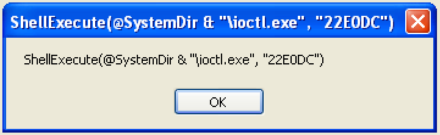<br>

A quick look at `main()` in `ioctl.exe` reveals that indeed, argv[1] is converted to an unsigned long int and used as the control code to be passed into `DeviceIoControl()`.

```C
int __cdecl main(int argc, const char **argv, const char **envp)
{
  const char *v3; // ST18_4@1
  unsigned __int32 v4; // ebx@1
  HANDLE v5; // esi@1
  int result; // eax@2
  HANDLE v7; // edi@3
  struct _OVERLAPPED Overlapped; // [sp+8h] [bp-24h]@5
  DWORD BytesReturned; // [sp+1Ch] [bp-10h]@1
  int OutBuffer; // [sp+20h] [bp-Ch]@1
  int v11; // [sp+24h] [bp-8h]@1

  OutBuffer = 0;
  v11 = 0;
  v3 = argv[1];
  BytesReturned = 0;
  v4 = strtoul(v3, 0, 16);
  v5 = CreateEventA(0, 1, 0, 0);
  if ( v5 )
  {
    v7 = CreateFileA(FileName, 0xC0000000, 3u, 0, 3u, 0x40000000u, 0);
    if ( v7 == (HANDLE)-1 )
    {
      printf("open device fail!\n");
      result = 1;
    }
    else
    {
      Overlapped.Internal = 0;
      Overlapped.InternalHigh = 0;
      Overlapped.Offset = 0;
      Overlapped.OffsetHigh = 0;
      ResetEvent(v5);
      Overlapped.hEvent = v5;
      if ( DeviceIoControl(v7, v4, 0, 0, &OutBuffer, 8u, &BytesReturned, &Overlapped) )
      {
        GetOverlappedResult(v7, &Overlapped, &BytesReturned, 1);
        result = 0;
      }
      else
      {
        printf("device ioctl fail!\n");
        result = 1;
      }
    }
  }
  else
  {
    printf("CreateEvent fail!\n");
    result = 1;
  }
  return result;
}
``` 

After setting up kernel debugging, I was able to set a bp in the `challenge.sys` kernel driver on the jump table I found which redirects the lpr from the request code to its correct handler. I then sent the IOCTL call to the kernel driver with the code "22E0DC" and traced it down the jump table into its handler function @ `0x29B620`. The IOCTL handler function consisted of a large sequence of "and" instructions and branches.
<br>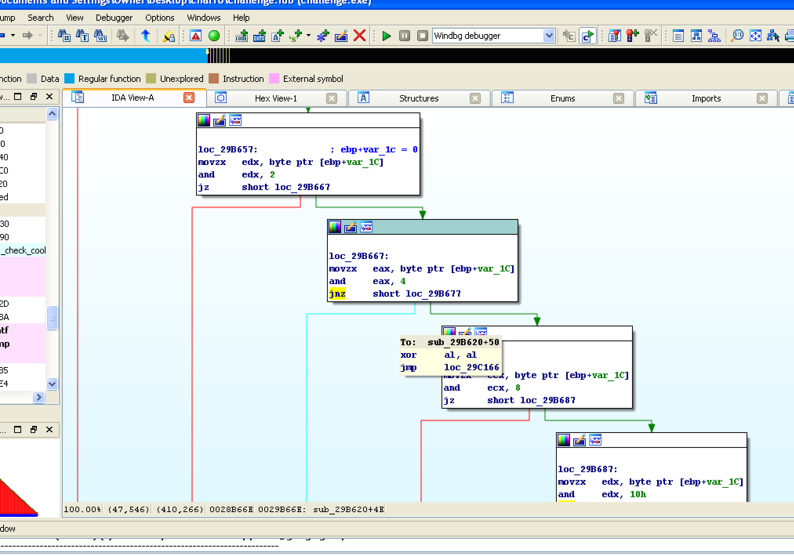<br>
Essentially, this function is responsible for determining the bits of a string. Decoding the string bit-by-bit produces the string, "try this ioctl: 22E068". I then sent another IOCTL call using "22E068" as the control code and traced it to what appeared to be a TEA decryption algorithm.
<br>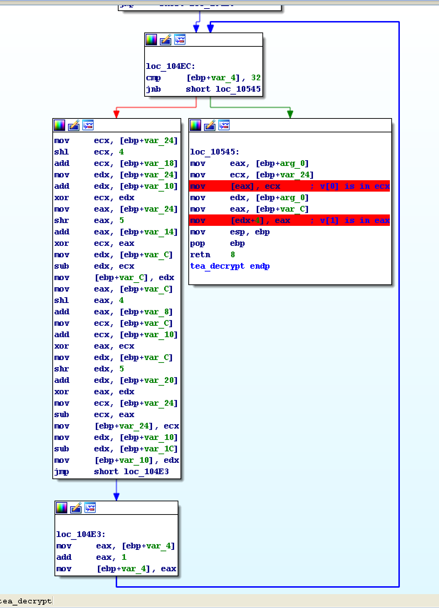<br>


Before the PC reaches the TEA decryption algorithm, however, it goes through a massive function (0x2C760) which passes 3 arguments into another function (0x10570): the key, an int which is later used to determine the number of rounds the decryption algorithm is iterated through, and the address of the buffer to be decrypted. 
<br>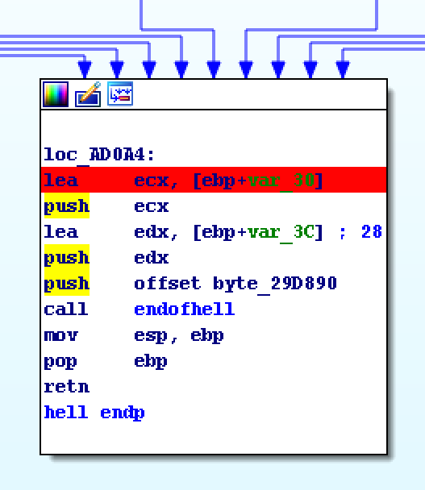<br>
The function  at 0x10570 passes chunks of the data in the buffer into the actual TEA decryption algorithm in multiple rounds. 
<br>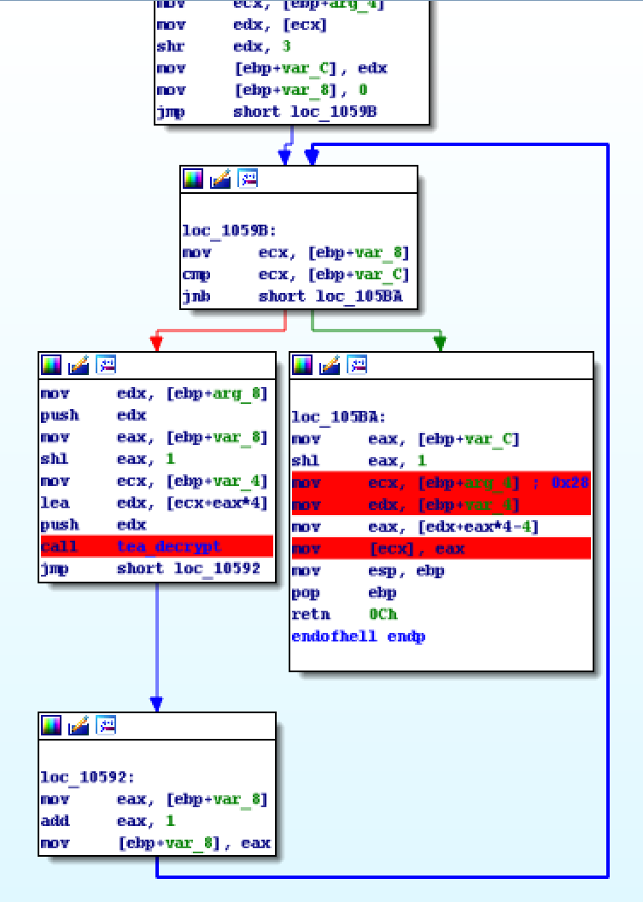<br>
After running a couple trials with WinDbg I noticed that the data contained within the buffer the TEA decryption algorithm decrypts changes with each runtime. However, the key and the number of rounds remain the same. After looking closer at the location of the buffer that is passed into the decryption function I notice it references many global variables. 
<br>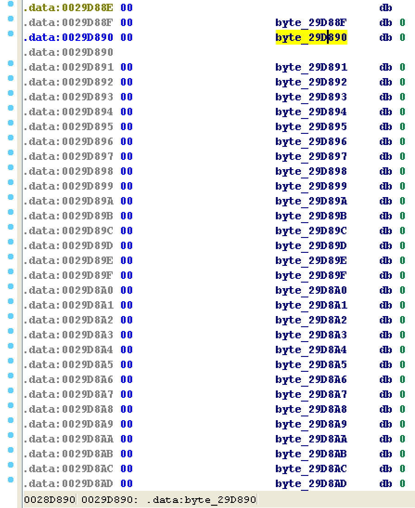<br>
I x-ref'd each global variable and noted they are all initialized to constant values before being mutated by presumably the aforementioned massive function in the control code handler.<br>
<br>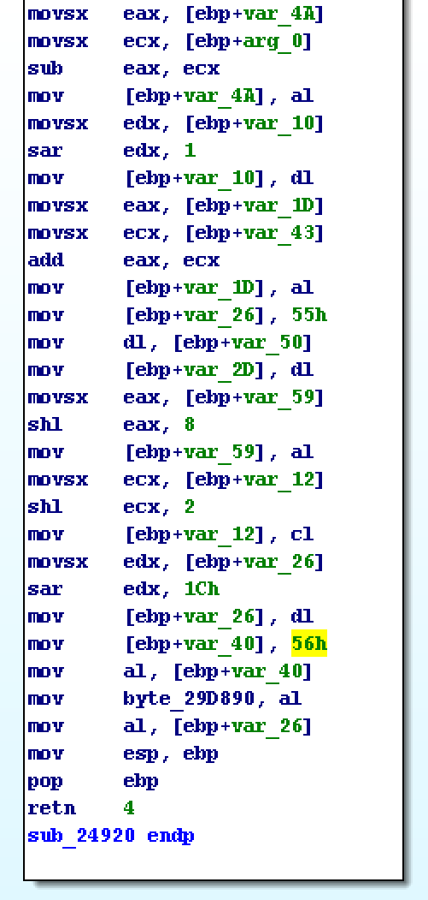<br>
Putting the bytes of the xref'd bytes together gave me
`567FDCFAAA2799C46C7CFC926161471A19B963FD0CF2B620C02D5CFDD97154964F43F7FFBB4C5D31`
which I hoped would produce something meaningful if passed into the TEA decryption function. 
From there, it was a simple matter of performing in-memory patching w/WinDbg of the contents of the buffer that get passed into the TEA decryption algorithm at runtime and examining the decrypted contents of the buffer to obtain the solution. 
```
kd> dp @edx-20
b1db9890  6f636e75 7469646e 616e6f69 6f635f6c
b1db98a0  7469646e 736e6f69 616c6640 6f2d6572
b1db98b0  6f632e6e 0000006d 00000000 00000000
b1db98c0  00000000 00000000 00000000 00000000
b1db98d0  00000000 00000000 00000000 00000000
b1db98e0  00000000 00000000 00000000 00000000
b1db98f0  00000000 00000000 00000000 00000000
b1db9900  00000000 00000000 00000000 00000000
kd> da @edx-20
b1db9890  "unconditional_conditions@flare-o"
b1db98b0  "n.com"
```
##Challenge 11
#####Binary: CryptoGraph
#####Type: PE Executable
#####Arch: x86

###Josh's Solution
This level was by far the most difficult in the challenge. At least, for me. After a combined total of ~30 hrs of painful reversing, however, I finally solved it. I lost a lot of time trying to understand everything the encryption did which turned out to be a trap.
<br><br><br>
Guess I should've listened to General Ackbar.

Fortunately, to solve this challenge, you don't really need to understand what everything does. You just need to understand enough to get the gist of how the program works and how what functions you do understand interact with each other. Half of reversing is just learning to block out the white noise and focusing on what's important: what happens to the data you can control.
 
When I ran the program without any arguments, the program sent back a message, "The number of parameters passed in is incorrect." Looking at the disassembly, I noted that it uses the WinAPI `CreateFile()` function to return a handle to a file it creates, named `secret.jpg`. The program also takes in 1 command line argument and if it is an integer, returns its hex equivalent which is subsequently passed into the function at address 0x401910.
<br><br>
I also noticed after running several trials with different numbers as the command line argument, that the program always seems to hang and never naturally terminates. After terminating the program forcefully, I notice it always outputs an empty `secret.jpg` file. My guess, then, was that I had to enter the correct argv[1] which would produce a valid .jpg file, hopefully containing the solution. First, I had to figure out what was causing the program to hang. 

For my test case, I ran the program in a debugger with `50` as argv[1]. Looking at the disassembly again in IDA, I traced the problem to function 0x401170 which contains a really long loop. The loop's jnz exit condition uses an outrageous number like 0xDBE8E5DB, or 3,689,473,499 in decimal which is slowly decremented bit by bit. 
After playing around with argv[1] for a bit, I noticed that different inputs change this exit condition number. So instead of having to iterate through the loop 0xDBE8E5DB times, if I changed argv[1] to `200`, I would only have to iterate through it 0xC53A3550 times!
<br>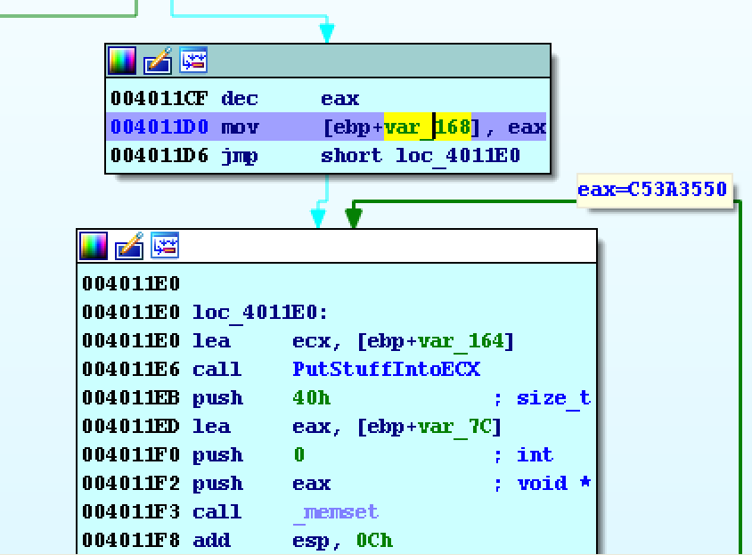<br>
<br>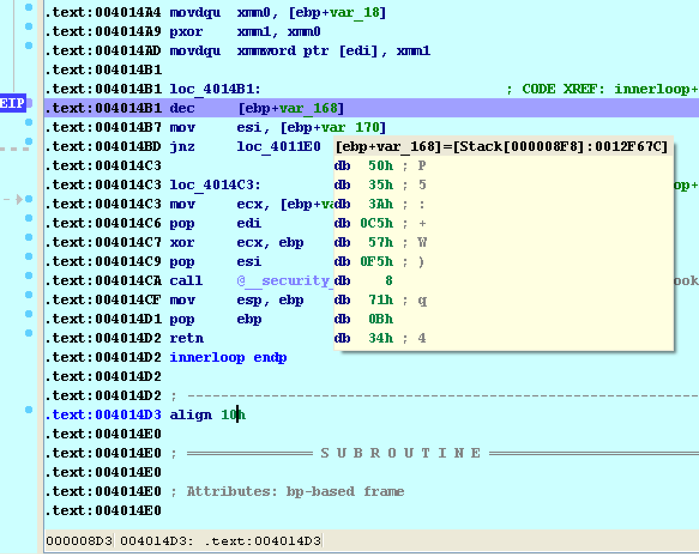<br>  
Yeah, not very helpful. I wasn't going to wait for that loop to finish, especially not while running the program on a really crappy Windows XP VM. So I had to try a different approach.
Tired and confused, I decided to take a step back and see exactly how argv[1] was affecting that exit condition value by following it. Perhaps there was a value I could use as argv[1] that would generate a reasonable exit condition? After all, at that point in the level, it was the only element of the program that I knew I could control.

While setting an initial hardware r/w bp on argv[1] and following the addresses where it is read or copied from, and setting bp's on those addresses and following where those are read or copied from, and so on and so forth, I noticed only the lower byte of the hex number ever gets used. 
This observation implies something useful: that one of the decimal numbers between 0 and 255 has to be correct and allow me to get through the loop without hanging.

256 numbers is easily brute-forceable so I whipped up a quick IDAPython script to find the correct value:
```python
from idaapi import *

def testval(i):
	StartDebugger("",i,"")
	GetDebuggerEvent(WFNE_SUSP, -1)
	continue_process()
	GetDebuggerEvent(WFNE_SUSP, -1)
	eax = GetRegValue("EAX")	
	GetDebuggerEvent(WFNE_SUSP, -1)
	StopDebugger()
	GetDebuggerEvent(WFNE_SUSP, -1)
	print eax
	return eax

#just set the bp manually. it's faster.
#AddBpt(0x004011D0)
#GetDebuggerEvent(WFNE_SUSP, -1)

for i in range(0,255):
	f = open('input.txt', 'r+')
	f.write(str(i))
	f.close()
	print "trying "+str(i)
	a = testval(str(i))
	if (a<0x7ffff):
		print i
		break
```
After grabbing a cold brew and getting a couple minutes of fresh air, I came back to the script which had finished and stopped at the decimal number 205. When 205 is used as argv[1] the loop only has to decrement from 0xFFFF or 65535, which, even on my slow ass VM, is instantaneous. 
However, after I exited this loop, I came across another obstacle. The function this loop is contained within is called within an outer loop at the end of function 0x4015D0 which depends on an exit condition which increments a value until it hits 0x20, or 32. 
<br>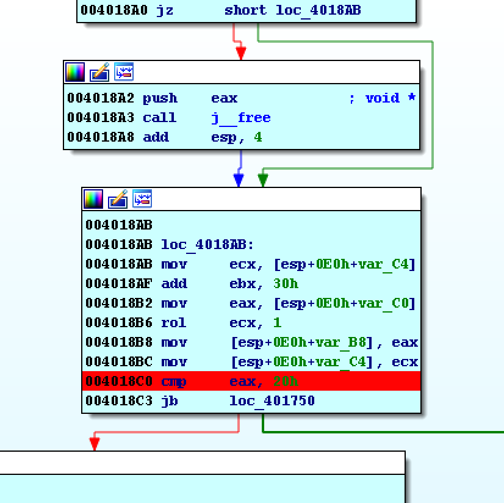<br>
And with each iteration, the value the exit condition references in the previous loop, 0xFFFF, increases substantially. So, it wasn't feasible, at least on my Windows VM, to wait for the entire loop to finish. Therefore, I was left with only two options: 1) buy a super computer 2) find a shortcut. I decided to go with 2). 

As it turns out, you don't have to wait for the entire loop to finish to generate a valid .jpg file. You can actually binary patch this loop to end it prematurely and still get a valid jpg file. You just need to figure out the exact number of times to let the loop run before exiting it. 

To do this, I first observed that the number of times the loop runs affects the value of a variable, [EBX+0x638], in function 0x401B60 upon which, several arithmetic calculations are performed to determine the flow of execution in this function. 
<br>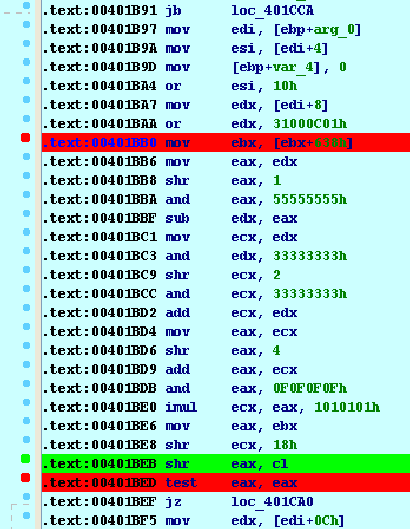<br>
This function appears to decrypt the data that is later written to the .jpg but only does so properly if the function call at address 0x401C45 which executes the function @ 0x401B20 can be reached. In order to do this I had to find the correct number of times to iterate through the loop in order to produce a variable which would allow the flow of execution to reach 0x401C45.
<br>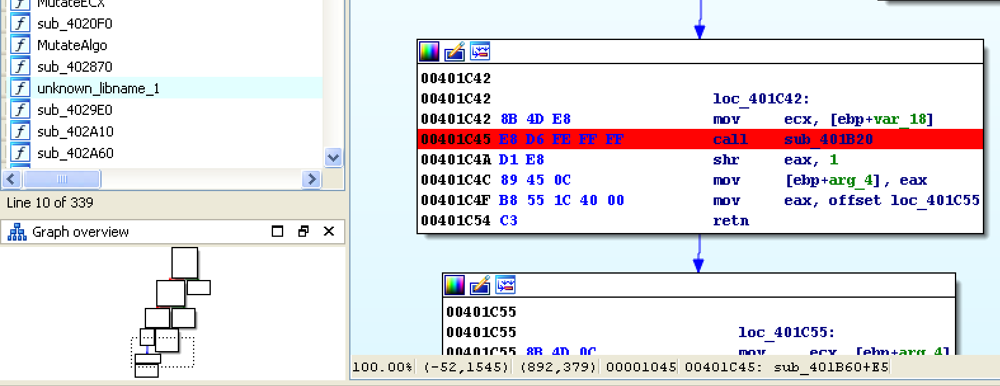<br>
After following the disassembly, and getting confused by Hex-Rays, I was able to reduce the problem of finding the variable, x, to the following: given a number x s.t. 0x0 < x < 0x7fffffff, the result of right shifting x by 0x18 != 0, and the result of right shifting x by 0x1a == 0. So now we have several constraints to play with, and what better way to find a number that satisfies these constraints than with our favorite SMT solver, Z3?
```python
#!/usr/bin/python
from z3 import *

x = BitVec('x', 32)

s = Solver()
s.add(x>0)
s.add(x<0x7fffffff)
s.add(x>>0x18 != 0)
s.add(x>>0x1a == 0)

print s.check()
print s.model()
```
Upon completion, this Z3 script reveals that the constraints can all be satisfied by the decimal number 33554432, or 0x2000000. So putting everything together, we now need to find the number of iterations of the loop in function 0x4015D0 to allow that will set the variable in function 0x401B60 to the value 0x2000000. 

After playing around with different exit conditions for the loop, I noticed a pattern and quickly figured out that I needed to let the loop run until it hit 0xB. So, I binary patched the loop condition to reflect this by changing the 0x20 to 0xB and let the program run to completion after passing it an exception. 
<br>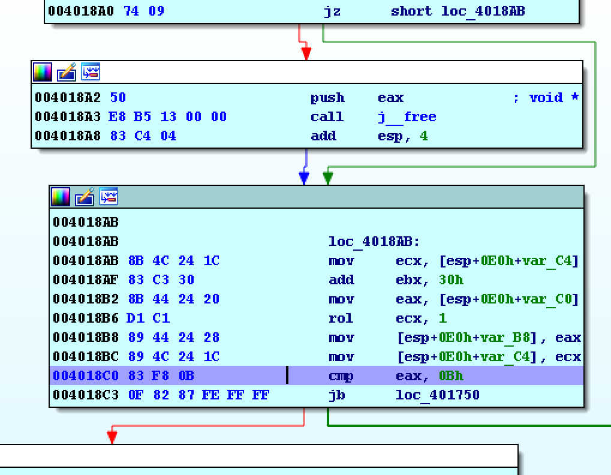  
Finally when I checked my file directory after doing this, I found a valid `secret.jpg` waiting for me. 
<br><br>


##Authors
Armen Boursalian and Joshua Wang
