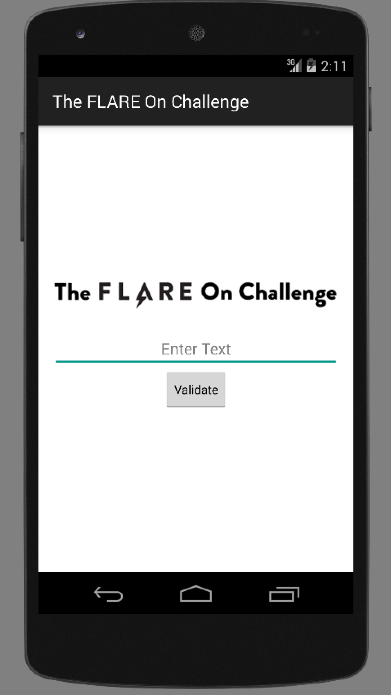

#Challenge 6                              
####Binary: libvalidate
####Type: Native Android Library
####Arch: ARM

##Josh's Solution

<br>

```Python
#!/usr/bin/python

import math

bases = [0xac3485d0,0xac346aa8,0xac344f80,0xac343458,0xac341930,
		 0xac33fe08,0xac33e2e0,0xac33c7b8,0xac33ac90,0xac339168,
		 0xac337640,0xac335b18,0xac333ff0,0xac3324c8,0xac3309a0,
		 0xac32ee78,0xac32d350,0xac32b828,0xac329d00,0xac3281d8,
		 0xac3266b0,0xac324b88,0xac323060]

solution=[]
target = []
chars = range(32,127)
for i in chars:
	for j in chars:
		target.append((i<<8)+j)

primes = []
print "[*] building list of primes..."
for num in range(2,30000):
	if all(num%k for k in range(2,num)):
		primes.append(num)

def lpf(i): #get least prime factor
	if i % 2 == 0:
		return 2
	else:
		f=3
		while f <= math.sqrt(i):
			if i%f==0:
				return f
			f = f+2
		return i

def chain(x):
	solution.append(chr(x>>8))
	solution.append(chr(x&0xff))
	
def getchunk(x,a=None,b=None,c=None,d=None,e=None):
	if x and a and b and c and d and e:
		if (x%a==0) and ((x/a)%b==0) and ((x/(a*b))%c==0) and ((x/(a*b*c))%d==0) and ((x/(a*b*c*d))%e==0) and all(x%y for y in primes if (y!=lpf(a) and y!=lpf(b) and y!=lpf(c) and y!=lpf(d) and y!=lpf(e))):
			return x
	if x and a and b and c and d and e==None:
		if (x%a==0) and ((x/a)%b==0) and ((x/(a*b))%c==0) and ((x/(a*b*c))%d==0) and all(x%y for y in primes if (y!=lpf(a) and y!=lpf(b) and y!=lpf(c) and y!=lpf(d))):
			return x
	if x and a and b and c and d==None and e==None:
		if (x%a==0) and ((x/a)%b==0) and ((x/(a*b))%c==0) and all(x%y for y in primes if (y!=lpf(a) and y!=lpf(b) and y!=lpf(c))):
			return x
	if x and a and b and c==None and d==None and e==None:
		if (x%a==0) and ((x/a)%b==0) and all(x%y for y in primes if (y!=lpf(a) and y!=lpf(b))):
			return x
	if x and a and b==None and c==None and d==None and e==None:
		if (x%a==0) and all(x%y for y in primes if (y!=lpf(a))):
			return x
print "[*] pwning..."
#rd 1
for x in target:
	a = 8
	b = primes[((0xac3485dc-bases[0])/2)]
	c = primes[((0xac348618-bases[0])/2)]	
	chunk = getchunk(x,a,b,c)
	if chunk:
		chain(chunk)
#rd 2
for x in target:
	a = primes[((0xac346aaa-bases[1])/2)]
	b = primes[((0xac3473da-bases[1])/2)]
	chunk = getchunk(x,a,b)
	if chunk:
		chain(chunk)
#rd3
for x in target:
	a = 4
	b = primes[((0xac344f86-bases[2])/2)]
	c = primes[((0xac3450cc-bases[2])/2)]
	chunk = getchunk(x,a,b,c)
	if chunk:
		chain(chunk)
#rd4		
for x in target:
	a = 8
	b = primes[((0xac343472-bases[3])/2)]
	c = primes[((0xac34347e-bases[3])/2)]
	chunk = getchunk(x,a,b,c)	
	if chunk:
		chain(chunk)
#rd5
for x in target:
	a = 2
	b = pow(primes[((0xac341934-bases[4])/2)],2)
	c = primes[((0xac3419ec-bases[4])/2)]
	chunk = getchunk(x,a,b,c)	
	if chunk:
		chain(chunk)
#rd6
chunk = primes[((0xac341456-bases[5])/2)]
chain(chunk)
#rd7
for x in target:
	a = 16
	b = primes[((0xac33e2ea-bases[6])/2)]
	c = primes[((0xac33e31c-bases[6])/2)]	
	chunk = getchunk(x,a,b,c)	
	if chunk:
		chain(chunk)
#rd8
for x in target:
	a = primes[((0xac33c7d8-bases[7])/2)]
	b = primes[((0xac33c86e-bases[7])/2)]
	chunk = getchunk(x,a,b)
	if chunk:
		chain(chunk)
#rd9
for x in target:
	a = 4
	b = primes[((0xac33aca8-bases[8])/2)]
	c = primes[((0xac33acd4-bases[8])/2)]
	chunk = getchunk(x,a,b,c)
	if chunk:
		chain(chunk)
#rd10
for x in target:
	a = primes[((0xac33916e-bases[9])/2)]
	b = primes[((0xac3395c8-bases[9])/2)]
	chunk = getchunk(x,a,b)
	if chunk:
		chain(chunk)
#rd11
for x in target:
	a = primes[((0xac337642-bases[10])/2)]
	b = primes[((0xac337fd0-bases[10])/2)]
	chunk = getchunk(x,a,b)
	if chunk:	
		chain(chunk)
#rd12
for x in target:
	a = 8
	b = primes[((0xac335b1a-bases[11])/2)]
	c = primes[((0xac335caa-bases[11])/2)]
	chunk = getchunk(x,a,b,c)
	if chunk:
		chain(chunk)		
#rd13
for x in target:
	a = pow(primes[((0xac333ff4-bases[12])/2)],2)
	b = primes[((0xac333ffa-bases[12])/2)]
	c = primes[((0xac33401c-bases[12])/2)]
	chunk = getchunk(x,a,b,c)
	if chunk:
		chain(chunk)
#rd14
for x in target:
	a = 4
	b = primes[((0xac332778-bases[13])/2)]
	chunk = getchunk(x,a,b)
	if chunk:
		chain(chunk)
#rd15
for x in target:
	a = pow(2,2)
	b = pow(primes[((0xac3309a2-bases[14])/2)],4)
	c = primes[((0xac3309a6-bases[14])/2)]
	d = primes[((0xac3309a8-bases[14])/2)]
	chunk = getchunk(x,a,b,c,d)
	if chunk:
		chain(chunk)
#rd16
for x in target:
	a = pow(primes[((0xac32ee7a-bases[15])/2)],2)
	b = primes[((0xac32f1d2-bases[15])/2)]
	chunk = getchunk(x,a,b)
	if chunk:
		chain(chunk)
#rd17
for x in target:
	a = 64
	b = pow(primes[((0xac32d352-bases[16])/2)],2)
	c = pow(primes[((0xac32d356-bases[16])/2)],2)
	chunk = getchunk(x,a,b,c)
	if chunk:
		chain(chunk)
#rd18
for x in target:
	a = 4
	b = primes[((0xac32b82a-bases[17])/2)]
	c = primes[((0xac32b82c-bases[17])/2)]	
	d = primes[((0xac32b836-bases[17])/2)]	
	e = primes[((0xac32b838-bases[17])/2)]
	chunk = getchunk(x,a,b,c,d,e)
	if chunk:
		chain(chunk)
#rd19
for x in target:
	a = 2
	b = primes[((0xac32a89e-bases[18])/2)]
	chunk = getchunk(x,a,b)
	if chunk:
		chain(chunk)
#rd20
for x in target:
	a = primes[((0xac3281f8-bases[19])/2)]
	b = primes[((0xac328280-bases[19])/2)]
	chunk = getchunk(x,a,b)
	if chunk:
		chain(chunk)
#rd21..almostdone
for x in target:
	a = 2
	b = primes[((0xac3266bc-bases[20])/2)]
	c = primes[((0xac3267d2-bases[20])/2)]
	chunk = getchunk(x,a,b,c)
	if chunk:
		chain(chunk)
#rd22...one more
for x in target:
	a = pow(primes[((0xac324b8c-bases[21])/2)],4)
	b = primes[((0xac324b96-bases[21])/2)] 
	chunk = getchunk(x,a,b)
	if chunk:
		chain(chunk)
#rd23...finally
for x in target:
	a = pow(primes[((0xac323064-bases[22])/2)],2)
	b = primes[((0xac323066-bases[22])/2)]
	c = primes[((0xac3230aa-bases[22])/2)]
	chunk = getchunk(x,a,b,c)
	if chunk:
		chain(chunk)

print ''.join(solution)
```

```Bash
rh0gue@deception:~/Documents/flareon15/chal6$ python chal6.py 
[*] building list of primes...
[*] pwning...
Should_have_g0ne_to_tashi_$tation@flare-on.com
```
