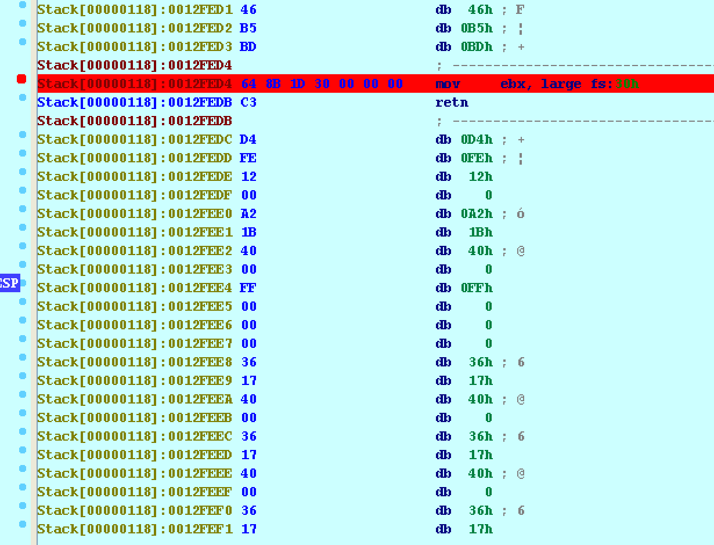
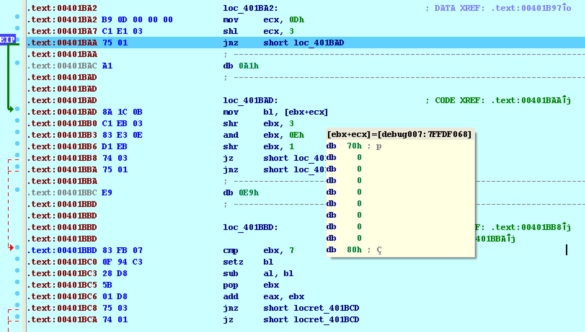

##Josh's Solution
I noticed there was anti-disassembly being employed so at first I tried manually fixing the bad bytes, turning code to data and vice-versa. However, after a while of doing this, I realized it would be too hard to do this for the whole program manually so I had to try another approach. I then skipped to the last CMP (0x401C27) it makes before branching to either "You are failure" or "You are success". The CMP statement didn't make any sense though because it compared EAX to 0x29, but despite trying different inputs, the value of EAX always remained 0x28d7. After playing around with the binary more and tracing execution, I noticed it referenced FS:[0x30], or the process's PEB. Specifically, it compared the value at offset 0x68 of the PEB to 0x70.
<br>
<br>
It was then I realized the program was employing anti-debugging and checking the NTGlobalFlag to determine whether or not the program was being run in a debugger, presumably changing the code somehow if it was. I then used IDAStealth to patch the NTGlobalFlag and then the final CMP made sense. It was checking and comparing to see how many correct characters were used in the right offset of the user input string. So, I wrote an IDAPython script to brute force the email address character-by-character, and went to bed. 

```python
from idaapi import *

def testval():
	StartDebugger("","< input.txt","")
	GetDebuggerEvent(WFNE_SUSP, -1)
	eax = GetRegValue("EAX")
	GetDebuggerEvent(WFNE_SUSP, -1)
	StopDebugger()
	GetDebuggerEvent(WFNE_SUSP, -1)
	return eax

AddBpt(0x00401C27)
GetDebuggerEvent(WFNE_SUSP, -1)

for i in range(1,41):
	for j in range(33,126):
		f = open('input.txt', 'r+')
		s = open('solution.txt','r')
		line = s.readline()
		f.write(line+chr(j))
		f.close()
		s.close()
		a = testval()
		if (a==i):
			s = open('solution.txt','a+')
			s.write(chr(j))
			s.close()
			break
```

The next morning, I had the e-mail solved.
